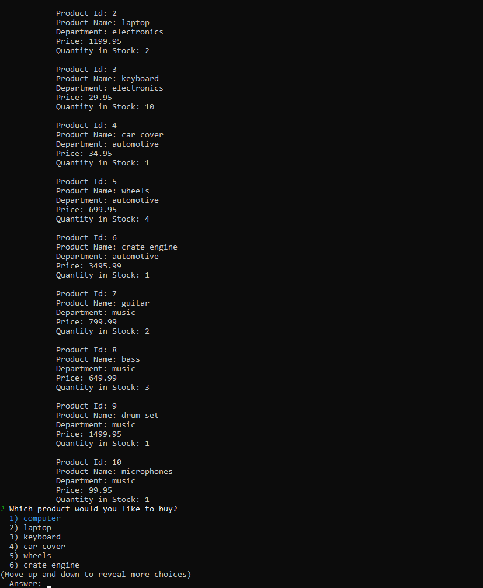
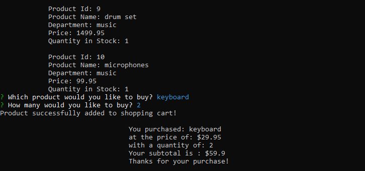
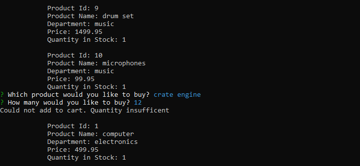

# Bamazon

## What does it do?
* The Bamazon app is your node application amazon store! Well, with limited supply. This app uses data from mysql database. From this database we can display what products are in stock, their related department, the cost of that item, and the quantity in stock. 
* This app uses the npm package inquirer to prompt the user what item they wish to purchase and the quantity. In the end, the program will display what item you purchased, the price of that product, the quantity, and the total. **IF** the user selected a quantity that is insufficient, the program will inform the user that there was insuffient quantity available and then restart the app. 
* Once the item has been purchased the table in the database will update the quantity on hand. 

## Conflicts and Technical Approach
* Began by creating a database, then a table in mySQL workbench. From there I began to insert values into the table. Once I had my table set up, I was able to move on to coding the program. 
* npm install dotenv, mysql, and inquirer. Create the connection between mySQL, an require the .env file. Once I was connected I continued to inquirer.
* Its basically one long function. I ran a for loop at the beginning to display to the user what products are available. Then, the user can select which product they would like to purchase from the prompt.
* Once the product is selected, run a .then(function(answer){}), which then prompts the user for the quantity they wish to buy. I ran another for loop and created a conditional if/else which states if the answer is equal to the results of the product index, then set the results index to the variable chosenItem. That way chosenItem is an object that I can display all of its properties. 
* Finally, when the quantity is chosen, I created an if/else statement to check if the quantity in stock is greater than quantity chosen, then calculate the total, update the table, and log the results. Else, log quantity insufficient and restart the program. 

## Links/SnapShots

Table data of all items

First prompt and results of successfull selection

Prompt when user request quantity insufficient
