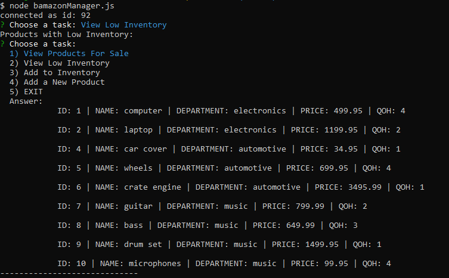
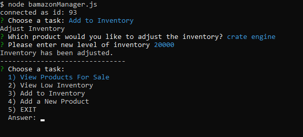
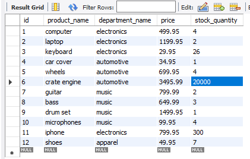
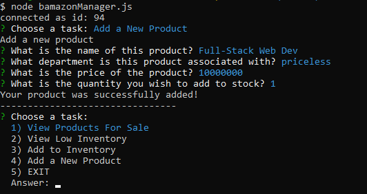
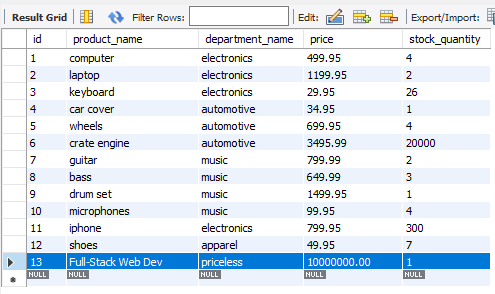

# Bamazon (Customer View)

## What does it do?
* The Bamazon app is your node application amazon store! Well, with limited supply. This app uses data from mysql database. From this database we can display what products are in stock, their related department, the cost of that item, and the quantity in stock. 
* This app uses the npm package inquirer to prompt the user what item they wish to purchase and the quantity. In the end, the program will display what item you purchased, the price of that product, the quantity, and the total. **IF** the user selected a quantity that is insufficient, the program will inform the user that there was insuffient quantity available and then restart the app. 
* Once the item has been purchased the table in the database will update the quantity on hand. 

## Conflicts and Technical Approach
* Began by creating a database, then a table in mySQL workbench. From there I began to insert values into the table. Once I had my table set up, I was able to move on to coding the program. 
* npm install dotenv, mysql, and inquirer. Create the connection between mySQL, an require the .env file. Once I was connected I continued to inquirer.
* Its basically one long function. I ran a for loop at the beginning to display to the user what products are available. Then, the user can select which product they would like to purchase from the prompt.
* Once the product is selected, run a .then(function(answer){}), which then prompts the user for the quantity they wish to buy. I ran another for loop and created a conditional if/else which states if the answer is equal to the results of the product index, then set the results index to the variable chosenItem. That way chosenItem is an object that I can display all of its properties. 
* Finally, when the quantity is chosen, I created an if/else statement to check if the quantity in stock is greater than quantity chosen, then calculate the total, update the table, and log the results. Else, log quantity insufficient and restart the program. 

## Links/SnapShots

- Table data of all items

- First prompt and results of successfull selection

- Prompt when user request quantity insufficient

# Bamazon (Manager View)

## What does it do?
* This time around we are looking into this app as if we are the manager of the company and want to run certain reports to maintain our buisness.
* We begin by using inquirer to prompt the manager of certain reports or procedures to run. We can "View Products For Sale", "View Low Inventory", "Add to Inventory", and "Add a New Product". Each answer will select a specific function to run that the manager selected. 

## Confilcts and Tech Approach
* First step was to config "dotenv", require inquirer and mysql. Once we did that, we could establish the connection to the database and run the start function that will prompt the manager a set of tasks. 
* Once the answer is selected from the choices prompt, we call the answer in our .then function and use a conditional if/else statement to run certain functions depending on the answer selected. I also added an EXIT choice which would end the connection so the user could escape the program.

### Products For Sale
* In this function we run a query that selects all the columns from table products. We run the results through a for loop and then log the results nicely to the console. Then call the start function so the user can select a new task.

### View Low Inventory 
* In this function we select all the columns in the table where the stock quantity is less than 5. We run the results through a for loop and then log the results nicely to the console. Then call the start function so the user can select a new task.

### Add To Inventory 
* This function gets a little more tricky. To conquer this challenge I created a query that selects all the columns from the table. The first prompt asks the user which item to adjust. The choices are configured by creating a choicesArray set to an empty array. Run a for loop and push the results[i].product_name to the choicesArray. Then we return the array. 
* Once the user selects which product they wish to adjust, I ran a for loop, checking if the answer equals the product name, and if so create a variable chosenItem which is equal the the results of that object (res[i]). Now we have full access to the entire object of that product that was selected.
* We can then run a prompt asking the user to enter the new level of inventory. With that answer we can finally run a query that updates the table and set the stock quantity to the answer.inventory_adjustment. 

### Add New Product 
* In order to add a product to the table, We need to prompt the user with a few questions. 
    1. (name) What is the name of this product?
    2. (department) What is the department this product is associated with?
    3. (price) What is the price of the product?
    4. (quantity) What is the quantity you wish to add?
* From there I ran a query to INSERT INTO the products table and SET ? ... I set the product_name to the answer.name, department to answer.department, price to answer.price, and stock_quantity to answer.quantity. From there the program will log that the product was successfully added and restart the program so the user can select another task. 

## Links/SnapShots

- View Low Inventory 

- Add To Inventory

- Add New Product

